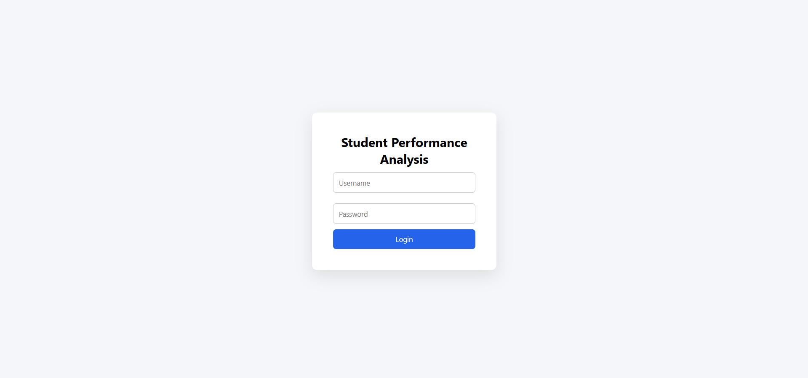
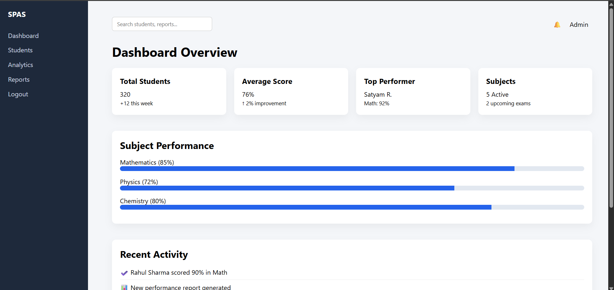
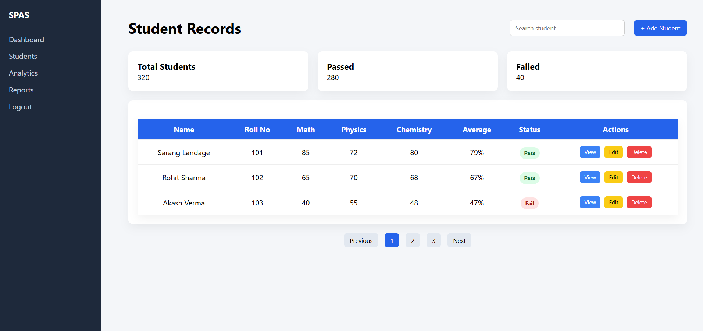
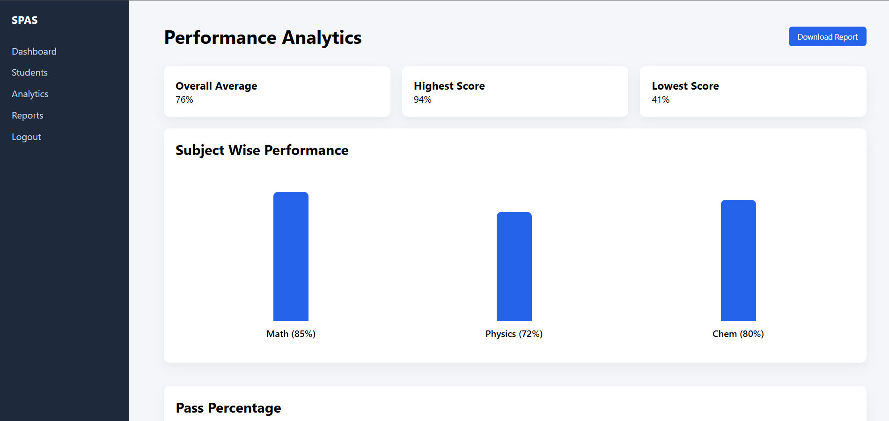
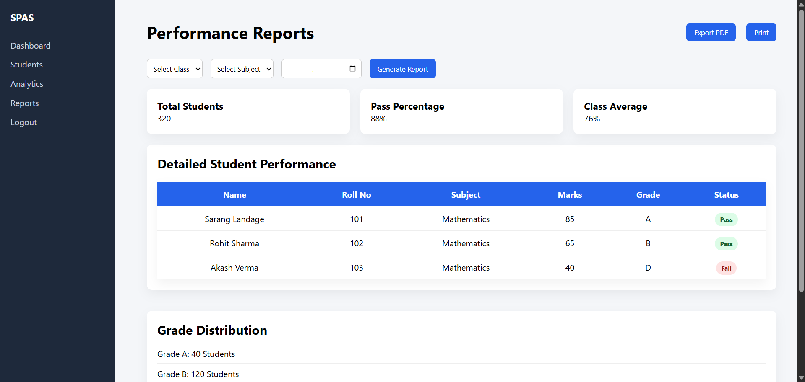

# Student Performance Analysis System (SPAS)

## 📄 Selected Research Paper

**Title:** Design and Implementation of a Web-Based Online Exam System with Screen Monitoring for Academic Integrity  
**Link:** https://www.researchgate.net/publication/400191452_Design_and_Implementation_of_a_Web-Based_Online_Exam_System_with_Screen_Monitoring_for_Academic_Integrity  
This research paper presents a web-based online examination system that integrates screen-monitoring to support academic integrity in digital assessments. Screen monitoring and tab-switching detection mechanisms help detect and deter dishonest behaviour during online exams, demonstrating a viable and replicable proctoring solution for educational institutions. :contentReference[oaicite:0]{index=0}

---

## 🎯 Project Objective

Develop HTML pages with CSS that closely resemble the output interface screens shown in the selected research paper.  
The focus was on replicating:

- Layout and page structure  
- Visual design and styling  
- Navigation between pages  

The final result is a multi-page UI system inspired by academic research.

---

## 🛠 Technologies Used

- HTML5  
- CSS3  

---

---

## 🖼 Screenshots

### 🔐 Login Page  

---

### 📊 Dashboard Overview  

---

### 👨‍🎓 Student Records  

---

### 📈 Performance Analytics  

---

### 📄 Reports Page  

---

## 📝 Page Details

### **Login Page**
User authentication interface with form fields and login button.

### **Dashboard**
Shows an overview of KPIs like total students, average scores, top performers, etc.

### **Students**
Displays a list of students with marks, grades, status badges, and action buttons.

### **Analytics**
Visual representation of subject performance using bar charts and circular progress indicators.

### **Reports**
Filterable report section with detailed tables and grade distribution, plus export/print options.

---

## 💡 Key Features

- Clean sidebar navigation across all pages  
- Professional UI components and cards  
- Tables with status badges and action buttons  
- Performance analytics visualizations  
- Report filtering and export UI  
- Print-ready sections  

---

## 🧠 Implementation Overview

This project replicates research-based UI screens by focusing on:

- Modern layout and clean design  
- Structured data display  
- Visual analytics and performance charts  
- Academic report format  

Screenshots were captured from the local UI and added under the `screenshots/` folder for reference.

---

## 📍 How to View the Project

1. Clone this repository.  
2. Open the `.html` files in a browser.  
3. Navigate between pages using the sidebar.  
4. View screenshots in the `screenshots/` folder.

---

## 👨‍💻 Developed By

**Name:** Satyam Rathod  
**Branch:** AIML (Artificial Intelligence & Machine Learning)  
**Year:** Second Year  

---

## 🔗 GitHub Repository

(Insert your repository link here)
